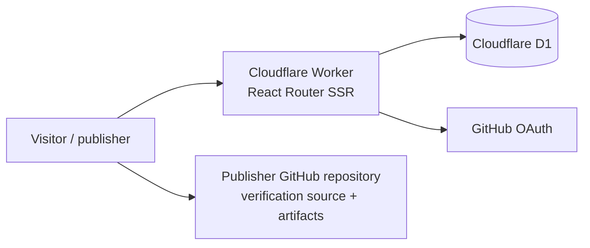
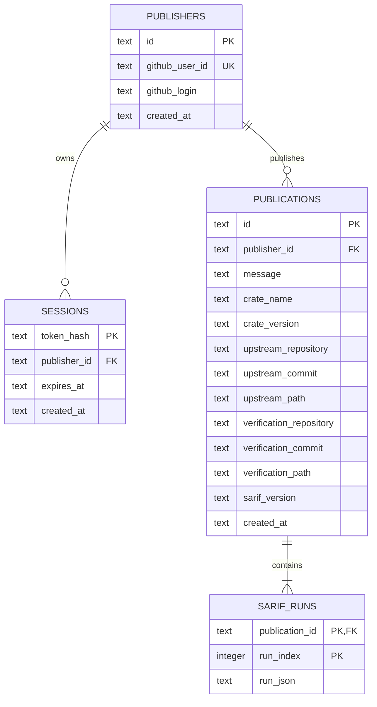

# proofs.rs PoC architecture

## User flow

1. A publisher modifies an upstream crate locally and runs one or more verification tools.
2. The publisher pushes the verification source and supporting artifacts to an immutable GitHub commit.
3. After GitHub login, the publisher submits one publication in the web UI: crate/version, upstream reference, verification-source reference, a commit-message-style explanation, and one SARIF 2.1.0 JSON document.
4. The Worker validates the metadata and SARIF shape, stores the publication and each SARIF run in D1, then redirects to the public detail page.
5. Visitors browse publications newest-first, then inspect targets, Rule IDs, descriptions, source locations, provenance, and raw runs.

The service records a publisher's assertion. It does not rerun a verifier, decide whether a result passed, or confirm that GitHub references exist.

## Runtime

- One Cloudflare Worker serves the SSR application and form actions.
- D1 stores application metadata, hashed sessions, and one JSON row per SARIF run.
- GitHub stores verification source and evidence artifacts. The OAuth access token is used only for `GET /user` and is discarded.
- Static client assets are content-hashed by Vite. Application and form responses are `no-store` and the temporary `workers.dev` deployment is `noindex`.

## Data model

There is deliberately no Rule or Result table. `result.ruleId` remains the exact registry label supplied by the publisher, including duplicates and case. Descriptions, targets, tool details, and source locations are read from the stored run JSON when a page is rendered.

## Main queries

- `GET /`: one indexed newest-first publication query (21 rows to produce a 20-row cursor page), then one `IN (...)` query for all runs on that page.
- `GET /publications/:id`: one publication/publisher join, then one ordered run query.
- `POST /publish`: one UTC-day count, then an atomic D1 batch containing the rate-limited publication insert and all run inserts.
- Session lookup: SHA-256 of the opaque cookie is matched against the indexed session table; plaintext session tokens are never stored.

## Cost envelope

The PoC is intended to remain on Cloudflare's Free plan. At the time this document was written, the official limits include:

- Workers: 100,000 requests per day.
- D1: 5 million rows read per day, 100,000 rows written per day, and 5 GB total storage.
- Workers Logs: 200,000 events per day with three-day retention.

At PoC traffic, the expected infrastructure bill is therefore **$0/month**. The dominant growth risk is D1 storage because SARIF JSON is stored directly; the web form caps each document at 1 MB. If the Free limits are reached, requests fail rather than silently upgrading the account. A paid Workers plan has a $5/month minimum before usage overages.

Current pricing must be rechecked before making a budget decision:

- <https://developers.cloudflare.com/workers/platform/pricing/>
- <https://developers.cloudflare.com/d1/platform/pricing/>

## Deployment order

1. Create `proofs-rs-db` and replace the placeholder D1 database ID in `wrangler.jsonc`.
2. Apply pending remote migrations.
3. Deploy the setup-gated Worker and note its exact `workers.dev` origin.
4. Create a GitHub OAuth App with callback `<origin>/auth/github/callback`.
5. Set `APP_ORIGIN`, `GITHUB_CLIENT_ID`, and the `GITHUB_CLIENT_SECRET` Worker secret.
6. Deploy again and smoke-test anonymous, OAuth, session, publish protection, 404, and security headers.
