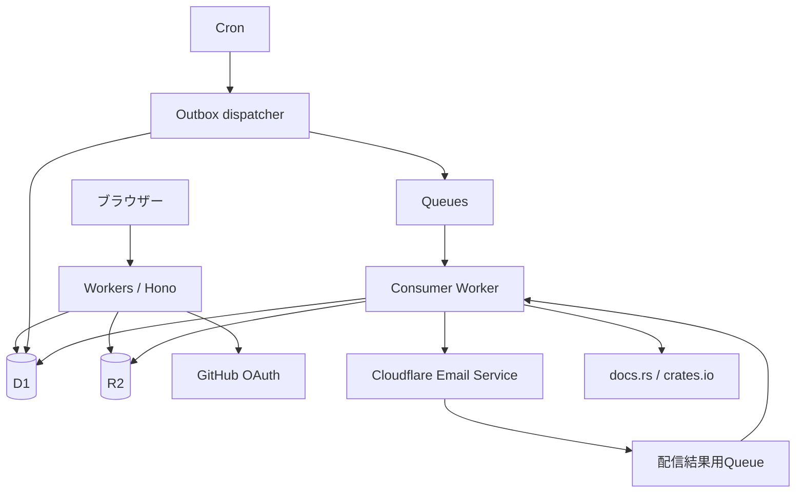
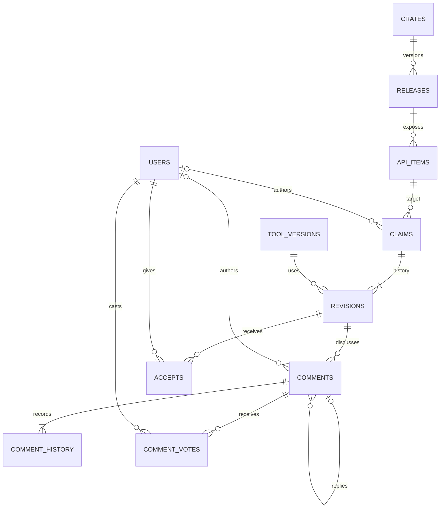
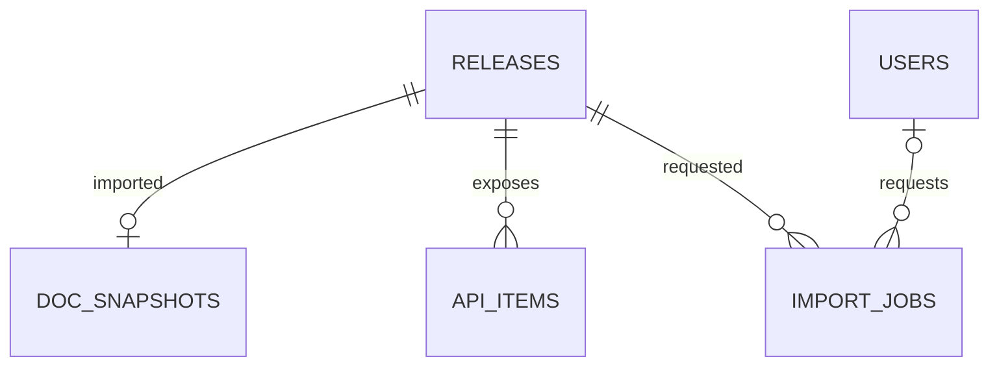
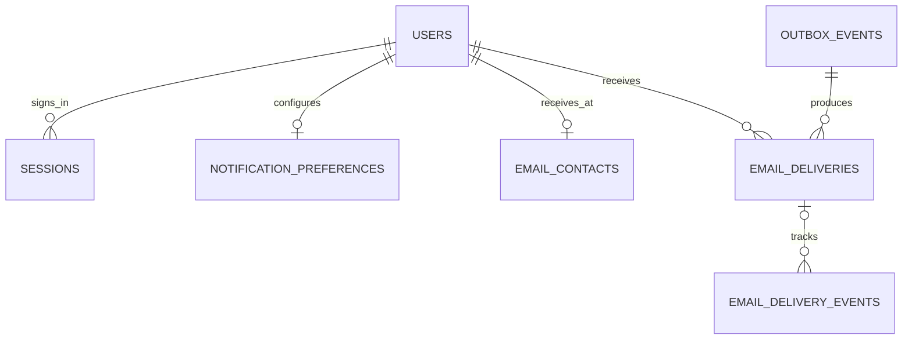

# proofs.rs バックエンド設計案 v0.15

2026-09-20 / 人による仕様レビュー済み。12章の確認事項はすべて確定しました。アプリケーションの実装・デプロイはまだ行っていません。

対象：Sitesのproofs.rs、v32として取得したソース（commit `ab46464`）。対象ファイルは `dist/app.js`, `features.js`, `reviews.js`, `account.js`, `publish.js`, `documentation.js`, `docs-data.js`, `legal.js` と既存の取り込みスクリプトです。READMEやconcept.mdよりも現在の画面コードと今回の合意を優先します。これはソース上の機能監査であり、実ブラウザーでの全画面受け入れ試験は実装段階に行います。

## 1. 合意済みの仕様

- サービスは検証器を実行しません。証拠・主張・議論を掲載します。Acceptや投票で正しさを認定しません。
- proofs.rsで初めてそのcrate + versionを投稿する準備段階で、その版の公開APIをdocs.rsから取得します。全クレート・全版の巡回取得はしません。取り込んだ版ではClaimがないAPIも表示します。
- 証拠はURLだけを必須とし、固定コミット・再現手順の入力は必須にしません。正当性は利用者同士の議論に委ねます。
- karmaは当面、同一Claim・同一評価者につき最大1点です。計算方式は交換可能なモジュールに分離します。
- コメント削除後も本文の位置に *deleted comment* を表示し、消された痕跡を残します。
- コメントの編集履歴・削除前本文を非公開の履歴としてDBに保存します。現時点では履歴閲覧UIは作りません。
- 初回投稿では先にAPI一覧を取得し、取得完了後に投稿者がPublishを押します。自動公開・保留投稿の保存は行いません。タブを閉じると未投稿の入力は失われます。
- APIは公開関数・固有メソッドだけを扱い、公開パスごとに別APIとします。traitメソッド・trait実装・Deref経由のメソッドは初期対象外です。
- 対応rustdoc形式を限定し、正常取込後のカタログは固定します。署名・unsafe情報とdocs.rsリンクを表示し、説明本文・コード例の転載は行いません。
- 通知メールの送信はCloudflare Email Service（Email Sending Beta）を採用します。Resendは使用せず、別契約も不要です。
- 通知先はGitHubの確認済みメールのみです。独自のメール変更・確認機能は作りません。
- 通知は新規コメント時のReply先とClaim作者のみです。編集では通知せず、@usernameは解析・リンク化・通知をしないplain textです。
- ソース管理とissue report / feedback / tool requestは https://github.com/nyuichi/proofs-rs に統一します。現在privateで、完成後にpublicへ切り替える方針です。この設計更新では切り替えません。
- 投稿・改訂・コメント編集ごとの規約版と同意時刻の保存は行いません。投稿別のconsentsテーブルは設けません。ユーザー単位では同意済み規約版と同意時刻を保存します。規約変更の文案と適用範囲は14章です。
- No UBにも前提条件欄を表示し、補足は `(optional; mandatory for unsafe APIs)` とします。safe APIでは任意、unsafe APIでは必須です。新規投稿・改訂・プレビューのUIとサーバー検証で同じルールを使います。
- 作者はClaimを撤回できます。本文・旧版・議論を残して「撤回済み」と表示し、karmaの集計対象から外します。
- コメント編集履歴・削除前本文は期限を設けず非公開で保持します。個人情報等の消去対応では履歴も削除可能にします。
- Claimのクレート・クレート版・API・性質は固定します。
- タイトル、前提条件、説明、信頼する仮定、ツールとその版、環境、証拠などは、新しいClaim revisionを追加して変更します。
- 旧版は残します。コメントは参照したrevisionに紐づけますが、議論はClaim全体にまとめて表示します。
- Acceptはrevisionごとで、新版へ引き継ぎません。
- docs.rs取り込みとメール送信の独立した事前検証・PoCは実施せず、実装着手の条件にしません（2026-09-20の指定）。実装時に仕様変更が必要と分かった場合は相談します。
- 運営主体はYuichi Nishiwaki個人です。規約・Privacy・Contactの運営者表記を統一します。
- 初期運用はCloudflare料金を月$10の目安として通知し、料金による停止は運営が手動で判断します。ハード上限ではありません。初期の管理手段はCLI/APIのみです。
- メールの受付成否が不明な場合は自動再送せず運営確認へ回します。通知が欠ける可能性を許容して重複送信を抑えます。
- コメントの編集後も票は維持し、コメント削除時は票を削除します。自己投票は禁止します。
- Acceptは現在有効なものだけを保持し、撤回履歴は保存しません。karma方式の変更時は過去の有効データにも新方式を適用し、撤回済み・非公開Claimを除外します。
- 退会時はAccept・票を削除して再集計し、投稿・議論は作者をghost化して残します。
- 初期対象はcrates.io公開済みの版のみです。yanked版・プレリリースも、対象APIを取り込めれば投稿できます。版の状態を表示します。
- docs.rsの取込構成に現れないAPIは投稿できません。不足を表示してGitHub Issuesへ案内し、独自ビルド・APIの手入力は追加しません。
- 取得済みでも初回Claim公開前の版は検索・版一覧に出しません。キャッシュは保持し、投稿フォームで再利用します。
- コメントは親子関係を持つ階層表示にします。返信への返信も親よりさらに1段字下げし、1段固定や時系列のフラット表示にはしません。返信先へのリンクを残します。
- コメント削除跡には作者名・日時・参照版・番号を残し、退会後の作者名はghostにします。削除済みコメントは件数と「最新の議論」から除外します。
- 返信時の参照版は親コメントの版を初期選択して送信前に明示します。
- 英語UI・UTC表示を維持します。コメントはルート同士・同じ親への返信同士を古い順に並べ、Claimは新規投稿が新しい順です。改訂でClaim一覧の先頭へは戻しません。
- 1 Claimにつき1性質とし、No panic・No UBの両方を主張する場合は別々のClaimを作成します。同じ内容の複数Claimは許可し、通信再送による二重作成だけを防ぎます。
- 証拠URLはHTTP/HTTPSのみ受け付け、非公開リンクも機械的には拒否しません。到達性・公開状態は検査しません。
- 作者は投稿者1人のみで、譲渡・共同編集は設けません。Acceptは「証拠を確認して妥当と考えた」という意味で、手元での再現成功は必須にしません。
- 登録ボタン付近に規約リンクと登録による同意を明示し、登録用の独立した同意画面・チェックボックスは設けません。毎投稿のチェックボックスも短い規約・ライセンス案内に置き換えます。
- 規約の即日改定は、既存ユーザーに変更内容と新規約を表示して「同意して続ける」を押してもらい、その人には同意時点から適用します。未同意の人へ一律に適用した扱いにはしません。14日前という固定の告知期間は設けません。
- 運営判断による投稿非公開・アカウント停止・例外的本文削除は、スパムや権利侵害に限定しません。サービスの趣旨・議論の秩序・安全性・運営上の必要性等に照らした合理的な判断で行い、理由・実施者・日時を監査記録に残します。
- モックの機能を本物にします。実装の難所や未指定のプロダクト挙動は、勝手に縮小せず確認します。

12章の仕様判断は承認済みです。実装上の暫定値・技術的詳細は委任範囲で具体化し、承認済みの挙動を変える必要が生じた場合は確認します。

## 2. 採用する構成案

| 要素 | 選定 | 役割・理由 |
|---|---|---|
| HTTPアプリ | Cloudflare Workers / TypeScript / Hono | 同一オリジンで画面とAPIを提供します。常駐サーバーは不要です。 |
| フロント | 既存HTML/CSSを維持し、JavaScriptをTypeScriptの画面モジュールに整理 | デザインを作り直さず、localStorage依存をAPIに置き換えます。Viteでビルドします。 |
| データベース | Cloudflare D1、SQL migration、prepared statement | リレーションと一意制約をDBで守ります。初期版ではORMを必須にしません。 |
| オブジェクト保存 | R2 Standard | 取込元JSONスナップショット、DBバックアップです。証拠ファイルのユーザーアップロードは現モックにないため追加しません。 |
| 非同期処理 | Cloudflare Queues + Cron + D1 outbox | API取込・通知送信です。D1の更新とジョブ登録を同時に確定し、Queue投入失敗を回収します。 |
| 認証 | GitHub OAuth + 自サービスのcookie session | GitHub数値IDで本人を識別します。通知先メールとログインを分離します。 |
| メール送信 | Cloudflare Email Service（Email Sending Beta） | Workers bindingでコメント通知を送信します。Workers PaidとCloudflare DNSが必要です。 |
| 問い合わせ受信 | Cloudflare Email Routing → 既存の受信メールボックス（案） | contact@proofs.rsを転送します。Email Routing自体はメールボックスではなく、転送先の指定が必要です。 |
| 配布・管理 | Wrangler、環境別設定、Gitでのソース管理 | 本番とステージングでD1/R2/Queue/OAuth/secretsを分けます。 |

本番はユーザー所有Cloudflareアカウントで運用します。既存Sitesモックはレビュー用として保持します。Sitesを本番ホスティングとして継続する場合、独自ドメイン・外部OAuth・Queue等の提供範囲を別途確認する必要があり、ここでは直接Cloudflareに配置する構成で料金を試算します。

HonoにはWorkers用の公式導入手順があります。Workersのメモリ上限は128MBであるため、巨大なrustdocを無制限に読み込む設計にはしません。[Hono](https://hono.dev/docs/getting-started/cloudflare-workers)・[Workers limits](https://developers.cloudflare.com/workers/platform/limits/)

## 3. モック全機能との対応

| 画面・操作 | 実サービスの振る舞い | 実装先 |
|---|---|---|
| トップの検索 | 登録済みクレート名を検索します。crates.io全件検索とは分けます。 | crates検索API |
| 最近更新されたクレート | 公開Claimの新規投稿・改訂の日時で並べます。初回Claim公開が完了するまでは一覧に出しません。 | 集計クエリ |
| 最新の議論 | 公開・未削除の新規コメントを日時順に表示します。編集では先頭へ戻しません。 | comments検索 |
| クレート一覧 | API数・Claim数・コメント数、ページングを表示します。API数は選択版、Claim数はClaim単位です。 | crates/releases |
| クレート版切替 | 初回Claim公開済みの版だけをSemVer順に表示します。初期選択は最新安定版、なければ最新プレリリースです。 | releases |
| API一覧 | 公開関数・メソッドをClaimなしも含め表示し、性質別のClaim数を示します。 | api_items / claims |
| API説明 | 署名・unsafe・出典・取込構成を表示し、説明はdocs.rsへのリンクとします。 | api_items |
| Claim一覧・詳細 | 同じAPI・性質の複数Claimを独立掲載します。一覧は新規投稿が新しい順で改訂によって先頭へ戻しません。詳細の初期表示は最新版です。 | claims / revisions |
| 投稿・プレビュー | フォームはタブ内メモリのみです。公開前にサーバー検証、公開時も再検証します。 | validate / create |
| 新版の公開 | 作者のみです。固定4項目の変更は拒否し、期待する旧revisionが一致した場合だけ追加します。 | revision create |
| 旧版リンク | `?v=N`で不変の版を開きます。存在しなければ404です。 | revision get |
| Claimの撤回 | 作者のみ撤回できます。本文・旧版・議論を保持し、撤回済みを表示してkarmaから除外します。 | claim withdrawal |
| コメント・返信 | Claim全体で親子ツリーを表示します。返信は親の下に置き、返信への返信もさらに1段字下げします。親IDと返信先リンクを保持します。 | comments |
| コメント編集 | 本人のみ、更新日時を表示します。参照revisionと返信先は変えません。 | comment update |
| コメント削除 | 本文を *deleted comment* に置き換え、作者名・日時・参照版・番号・URL・返信先を残します。退会後の作者名はghostです。件数と最新の議論には含めません。 | comment delete |
| コメント投票 | 1人1コメントに+1/-1/なしです。合計のみ公開し、本人の票だけ本人に返します。 | comment_votes |
| Acceptと撤回 | 1人1revisionに1件、自己Accept不可です。旧版にも付けられます。 | accepts |
| Accept一覧・My accepts | 対象revisionと日時を表示し、過去版であることを明示します。 | accepts検索 |
| karma | 同一Claim・同一評価者の有効Acceptを全版で重複排除して1点とします。方式は交換可能にします。 | KarmaPolicyモジュール |
| GitHubログイン・ログアウト | OAuthと失効可能なセッションです。 | auth |
| ユーザー活動ページ | GitHubプロフィールへのリンク、公開投稿一覧、karma、登録日を表示します。自己紹介の入力・保存は行いません。メール情報と削除案内は本人専用の設定画面に置きます。 | users |
| My claims / My comments | 所有者の投稿・削除済みコメントの参照をページングします。 | 所有者検索 |
| 通知設定 | Reply・自分のClaimへの新規コメントを個別設定します。メンション設定は削除します。 | notification_preferences |
| 通知先メール | GitHubの確認済みメールを表示します。変更はGitHub側で行い、再ログイン時に同期します。 | email_contacts |
| ツール一覧・版・Claim一覧 | 運営管理のカタログです。利用停止した版も既存Claimで表示できます。 | tools / tool_versions |
| issue report / feedback / tool request | nyuichi/proofs-rsのGitHub Issuesに集約し、種別ごとのIssueテンプレートを用意します。 | 外部リンク |
| 退会依頼 | 既存のmailtoを維持し、本人確認後に運営が退会処理を実行します。 | 運営CLI/API |
| About・規約・Privacy・Contact | 静的ページを維持し、採用事業者・実際の保存期間と内容を整合させます。 | 静的コンテンツ |
| 規約・ライセンスの案内 | 毎投稿のチェックボックスを撤去し、ボタン付近に短い案内を表示します。投稿別同意ログは保存せず、ユーザー単位の規約同意版・時刻だけを記録します。 | 静的案内 / users |
| 登録・規約改定への同意 | 登録前にボタン付近の注記を表示します。即日改定時は変更内容・新規約と「同意して続ける」を表示し、ユーザーごとに適用します。 | auth / terms |
| 旧URL | hash URLの移行用ルーターを残します。IDを配列indexとして扱いません。 | フロント互換ルート |

最新コードで投票UIがあるのはコメントです。READMEにあるClaim投票の記載を根拠に、存在しないClaim投票は追加しません。課金、ファイル投稿、検証ジョブ、正誤判定、リアルタイム配信も今回の対象に含めません。

## 4. ER図：Claimと議論

APIはクレート版に属します。したがって、Claimの `api_item_id` と `property` を固定すれば、4項目を固定できます。Claimとrevisionを分けることで、対象や作者を各revisionで重複管理しません。

作者の0..1は退会後に作者関連を外すためです。通常の投稿時には必ず作者がいます。commentが属するClaimはrevisionから決まります。DBでは返信先とrevisionが同じClaimに属することも検証します。

### 4.1 中核テーブルと制約

以下は論理スキーマです。全テーブルで日時はUTCを使用します。`PK`は主キー、`UQ`は一意制約、`FK`は外部キーです。表示IDと並び順は永続値です。Claimは整数の公開番号、コメントは独立IDとClaim内連番を持ち、削除後も番号を再利用しません。旧モックの架空IDは本番の実投稿へリダイレクトしません。

| テーブル | 主な列 | 必須制約・索引 |
|---|---|---|
| users | id PK, github_id UQ, username UQ, role, status, accepted_terms_version, terms_accepted_at, created_at | github_idは変更不可。認証判定はusernameで行いません。 |
| crates | id PK, registry, name, description, updated_at | UQ(registry,name)。初期対象はcrates.io公開済み版のみです。 |
| releases | id PK, crate_id FK, version, checksum, yanked, created_at | UQ(crate_id,version)。checksumでcrateの実体を固定します。 |
| api_items | id PK, release_id FK, canonical_key, display_path, kind, is_unsafe, created_at | UQ(release_id,canonical_key)。canonical_keyは公開パスとAPI種別です。re-exportの別パスは別APIとし、同一実体への集約はしません。signatureとupstream_urlも保持します。 |
| claims | id PK, api_item_id FK, property, author_id nullable FK, visibility, withdrawn_at nullable, created_at, updated_at | propertyはpanic_contract/no_ub。対象と性質を変更するAPIを設けず、DB triggerでも更新を拒否します。索引(api_item_id,property,created_at)、(author_id,created_at)。 |
| claim_revisions | claim_id FK, revision_no, title, precondition, explanation, trusted_assumptions, tool_version_id FK, environment, evidence_url, limitations, created_at | PK(claim_id,revision_no)。公開後は通常操作でUPDATE/DELETE不可。Panic contract、およびunsafe APIへのNo UBではprecondition必須（空白のみも拒否）。safe APIのNo UBでは任意。unsafe判定は入力値を信用せずapi_items.is_unsafeを参照し、プレビュー・新規投稿・改訂でサーバー検証します。 |
| comments | id PK, claim_id, sequence_no, revision_no, author_id nullable FK, reply_to_id nullable FK, body nullable, edit_version, created_at, edited_at, deleted_at, visibility | UQ(claim_id,sequence_no)、FK(claim_id,revision_no)。親コメントは同じclaim_id。本文上限5000文字、UTF-8 payload上限も設けます。索引(claim_id,reply_to_id,created_at,id)、(author_id,created_at,id)。 |
| comment_history | comment_id FK, history_no, action, body nullable, actor_id nullable FK, created_at | PK(comment_id,history_no)。create/edit/deleteを追記し、変更時に全文を保存します。deleteイベントは本文null、削除前本文は直前履歴に残ります。一般APIへ返しません。 |
| comment_votes | comment_id FK, user_id FK, value, updated_at | PK(comment_id,user_id)、CHECK value IN(-1,1)。0は行削除。自己投票は認可とDB triggerで拒否し、コメント削除時は票も削除します。 |
| accepts | claim_id, revision_no, user_id FK, created_at | PK(claim_id,revision_no,user_id)、複合FKで実在revisionを参照。自己AcceptはDB triggerと認可で拒否します。 |
| tools | id PK, slug UQ, name, description, official_url, active | 運営のみ更新可能です。 |
| tool_versions | id PK, tool_id FK, version, selectable | UQ(tool_id,version)。投稿可能性と既存データの表示を分離します。 |

証拠については `evidence_url` のみ必須です。`source_ref`, `reproduction_steps`, `verification_scope` の専用必須列・入力は追加しません。URL形式の検査は行いますが、内容の正当性・再現性・公開状態は審査しません。コミット固定を強制せず、外部リンクの内容が後日変わり得ることもそのまま扱います。

最新版は `MAX(revision_no)` から導出し、claimsに最新版ポインターを重複保存しません。新規Claimとv1を同一batchで作成します。新revisionはexpected_revisionが現在の最大版と一致する場合だけINSERTし、結果が0行なら409です。revisionの複合PKでも同時改訂を防ぎます。固定列の不変性と同様、通常経路でrevisionのUPDATE/DELETEを拒否するDB triggerを置きます。規約対応等のredactionは監査付きの特権運営手順に限定します。

## 5. ER図：API取込（簡略化後）

| テーブル | 主な列・制約 |
|---|---|
| doc_snapshots | id PK, release_id UQ/FK, target, features_json, rustdoc_format, rustc_version, source_url, source_hash, r2_key, imported_at。正常に公開するsnapshotは1版1件です。 |
| import_jobs | id PK, release_id FK, requested_by nullable FK users, status, attempts, error_code, next_retry_at, created_at。未完了の同一release取込を一意化します。 |

前案のpending_publicationsとapi_documentsは廃止します。署名・unsafe・出典URLはapi_itemsに置き、説明本文は抽出・保存・配信しません。取得元JSONそのものは非公開R2に残します。

投稿画面でcrateと完全なversionを指定し、明示的な「API一覧を取得」操作を行います。取込済みなら即再利用し、未取得なら取込ジョブだけを登録します。入力欄のキーストローク・通常閲覧・検索からは取得しません。取得中もフォーム入力はタブ内メモリだけに保持し、サーバーへ投稿予約は保存しません。取込後にAPIを選び、プレビューを経て投稿者がPublishを押した時点でClaimを作成します。

タブを閉じても取込ジョブは継続してキャッシュになりますが、投稿内容は失われ、自動公開されません。取得失敗・非対応形式・API不明ではPublishできず、取込再試行や入力修正を案内します。POST /claimsも取込済み・対象API存在を再検証します。

同じcrate + versionの同時取得を一意制約とleaseでまとめ、失敗はbackoff・回数上限付きで再試行します。全件巡回・依存クレートの再帰取得は行いません。正常取込済みデータの自動更新・通常の再取込操作は設けません。不具合修正が必要な場合のみ、既存Claimの参照を維持する個別migrationをレビューします。

docs.rsの版固定rustdoc JSONを利用します。例は `https://docs.rs/crate/arrayvec/0.7.6/json.gz` です。format_versionをallowlistで判定し、未対応の形式は明示的に拒否します。具体的な対応番号は実装で採用するrustdocスキーマに合わせて固定します。対応番号を決めるための実データPoCは行いません。[docs.rs Rustdoc JSON](https://docs.rs/about/rustdoc-json)

公開関数・固有メソッドの到達可能な公開パスを抽出します。trait・trait実装・Deref経由メソッドは対象外です。re-exportによる別パスは同一視しません。ただし公開到達性・re-export先の解決自体は必要で、解析が完全に不要になるわけではありません。docs.rsのビルド構成にないfeature/targetのAPIは扱えない旨を表示します。

crates.ioで版とchecksumを解決 → JSON取得 → サイズ・形式検査 → API抽出 → R2保存・DBステージング → 正常完了を一括確定、の順です。失敗した部分データは閲覧・投稿対象にしません。APIが0件と取得失敗も区別します。

初期の保護値は圧縮20MB・展開30MB・CPU2分以内を暫定値とし、事前PoCによるメモリ増幅の測定は行いません。この値は実測による動作保証ではありません。超過時は明示的エラーで止め、外部ビルドへ自動フォールバックしません。取得先とredirect先のホストを制限し、User-Agent・timeout・rate limitを設定します。Rustや投稿者のbuild.rsは実行しません。

## 6. アカウント・通知・運営データ

| テーブル | 主な列・制約 |
|---|---|
| sessions | token_hash PK, user_id FK, created_at, expires_at。ブラウザーには高エントロピーの原本、DBにはhashのみです。 |
| oauth_flows | state_hash PK, pkce_verifier保護値, expires_at, return_path。10分期限、1回限り、戻り先は同一オリジン限定です。 |
| email_contacts | user_id PK/FK, address, verified_at, delivery_status。メールアドレスをアカウント同一性には使いません。 |
| notification_preferences | user_id PK/FK, replies, claim_comments, updated_at。初期値はモックどおりtrueです。 |
| outbox_events | id PK, type, aggregate_id, dedupe_key UQ, payload, created_at, enqueued_at。書き込みと同じDB batchで登録します。 |
| email_deliveries | id PK, event_id FK, user_id FK, category, status, attempts, provider_id, next_attempt_at, created_at。UQ(event_id,user_id)で複数通知理由を1通にします。 |
| email_delivery_events | event_id PK, provider_id, delivery_id nullable FK, type, event_at, processed_at。配信結果の重複排除・未照合イベントの回収用です。必要最小限の情報のみ保持し、公開APIには返しません。 |
| idempotency_keys | user_id FK, operation, key, request_hash, resource_id, expires_at。PK(user_id,operation,key)、公開投稿の二重作成を防ぎます。 |
| audit_events | id PK, actor_id nullable FK, action, target_type, target_id, reason, created_at。運営操作を記録し、通常の公開APIには返しません。 |

OAuthではGitHub IDでupsertし、private repository権限は要求しません。メール取得が必要な最小scopeに限定し、取得後のGitHubアクセストークンは原則保存しません。stateとPKCEを使い、コールバック・セッション固定攻撃を防ぎます。ユーザー名変更で既存ユーザーと紐づけ替えず、公開活動ページの恒久URLは内部IDを基準にし、表示名slugは互換解決します。[GitHub OAuth](https://docs.github.com/en/apps/oauth-apps/building-oauth-apps/authorizing-oauth-apps)

session cookieはSecure / HttpOnly / SameSite=Lax、寿命30日の案です。書込リクエストはOriginとCSRF tokenを確認します。ログアウト時にはDBのsessionを失効させます。APIはメール・他人の投票履歴・認証情報を公開レスポンスに含めません。

通知は新規コメントの作成時だけです。Replyはreply_to_idで指定した親コメント作者、Claim通知はClaim作者です。自分宛は送らず、同じコメントから同じ人へは最大1通です。投稿時と送信直前の両方で設定を確認し、削除・非公開・退会済みは送信しません。コメント編集・削除では通知イベントを作りません。@usernameは通常のテキストで、ユーザー解決・リンク化・通知をしません。Reply先とClaim作者が同じなら1通にまとめます。本文はplain textで、任意HTMLをメールへ埋め込みません。

Queueは少なくとも1回の配信を前提とします。D1のdelivery一意制約と条件付き状態更新で送信権を取得し、送信済み・送信中のdeliveryは再配送されても送信しません。Consumerから `env.EMAIL.send()` を呼び、返されたmessageIdをprovider_idへ保存します。公開Workers APIでは送信の冪等キー保証を確認できていないため、DB更新との間を含むexactly-once送信は保証しません。送信受付後の応答消失・送信中のWorker終了など、受付成否が不明なdeliveryはunknownにし、自動再送せず運営確認へ回します（N7、確定）。明確な受付前の一時拒否だけ指数バックオフ・回数上限付きで再試行し、恒久エラーは停止します。Cloudflareが受け付けた後の一時配送失敗はCloudflare側の再配送に任せます。dead-letterと監査付き手動再試行を設け、日次quota等で遅延する場合は設定画面に表示します。[Workers送信API](https://developers.cloudflare.com/email-service/api/send-emails/workers-api/)

email_deliveriesには送信状態pending/sending/accepted/delivered/deferred/bounced/failed/rejected/complained/unknown、送信開始時刻、送信試行token、送信時宛先の保護値を保持します。acceptedは受信箱への到達を意味しません。配信結果はEmail SendingのEvent subscriptionsから専用Queueへ受け取り、messageIdで関連付けます。eventIdを一意保存するemail_delivery_eventsで重複処理を防ぎ、順不同でも古いイベントで最終状態や送信抑止を巻き戻しません。送信時宛先はバウンス処理に必要な範囲で非公開に保持し、退会時には消去します。対応する送信行が未確定の場合はイベントを保留して後で照合します。[配信イベント](https://developers.cloudflare.com/email-service/platform/event-subscriptions/)

通知先はGitHubのprimaryかつverifiedなメールを使います。取得できなければ通知を停止し、GitHub側での設定と再ログインを案内します。GitHub側でprimaryメールを変更・確認済みにした後、proofs.rsへ再ログインすると通知先も新しいアドレスへ同期します。ログイン中の即時同期や定期ポーリングは行いません。送信待ちの通知も送信時点の現在の通知先を参照します。GitHubの数値IDで本人を識別するため、メール変更によって別アカウントにはなりません。GitHub APIが一時的に失敗した場合は既存連携を上書きせず再認証を案内します。独自のメール変更・確認・再送・取消の画面、API、tokenは設けません。bounce/complaintは専用Queueの配信イベントから受け取り、想定account・送信domain・subscriptionとスキーマを検証します。対象の送信時アドレスへの通知を抑止し、ユーザーが後から変更した別アドレスを誤って抑止しません。Cloudflare側のsuppressionも尊重します。

## 7. 不変条件と競合処理

1. Claimの対象・性質・作者の通常変更はできません。退会で作者をnullにする操作だけ運営経路で許します。
2. revisionは追記のみです。最新版番号を画面から送り、古ければ409でフォームを保持します。DBの複合PKでも競合を検知します。
3. 投稿、outbox、冪等記録は一つのD1 batchで確定します。途中失敗で半端な公開を残しません。
4. AcceptはPUT/DELETEです。トグルAPIを作らず、リトライで状態が反転しないようにします。撤回したAcceptは即座に集計対象から外れます。同じClaimへの他版のAcceptが残る場合は、その評価者による1点を維持します。
5. コメントはedit_versionで楽観ロックします。作成・編集・削除時にcomment_historyへの追記と現在コメントの変更を同じbatchで確定します。履歴番号の一意制約と競合時rollbackで欠落・二重履歴を防ぎます。削除済みコメントは編集・投票できません。編集後も既存の票を維持します。コメント削除時は票も同じbatchで削除し、自己投票はサーバー認可とDB制約で拒否します。
6. 返信は既存かつ同一Claimのコメントに限定します。親は変更不可で循環を作れません。削除された親も参照でき、deleted commentを親ノードとして残すため子孫の階層は変わりません。表示は親の下に子を配置するツリーで、深さごとに字下げを1段増やします。深さで字下げを打ち切って1段にまとめません。ルート同士・同じ親への返信同士は投稿日時とIDで古い順に安定して並べます（O6確定）。返信フォームでは親コメントのrevisionを初期選択し、送信前に明示します。番号は投稿時のClaim内連番を維持するため、ツリー表示で番号順になるとは限りません。
7. karmaは7.1節の交換可能モジュールから計算します。票数は元テーブルから算出します。キャッシュ値を正本とせず、再計算可能にします。
8. DBとR2には分散トランザクションがないため、R2保存→DB公開の順にし、未参照オブジェクトは後で回収します。未完了snapshotを閲覧APIに出しません。
9. 同じcrate版の未完了取込の再試行・同じ送信イベントの再配送を一意キーで抑えます。
10. D1 read replicaは初期に使わず、投稿直後に古い版が返る問題を避けます。導入時にはSessions API等でread-after-writeを設計します。

D1のbatchはトランザクションとして実行されます。SQL内で整合性を守り、ネットワーク呼出しを含む長いDBトランザクションにはしません。[D1 Database API](https://developers.cloudflare.com/d1/worker-api/d1-database/)

### 7.1 karmaの差し替え設計

外部ユーザーが任意コードをロードする「プラグイン機構」は作らず、運営が交換できる内部インターフェースに分離します。DBのAcceptデータ、Claimの作者、削除・可視性情報を正本とし、UIやAccept APIに点数計算を埋め込みません。

- `KarmaPolicy` は `id`, `version`, `compute(input)` を持つ純粋な計算契約です。取得・集計の最適化は同じ契約を満たすrepository側で行います。
- 撤回済み・非公開Claimはkarmaの集計対象から外します。Acceptの元データや過去revisionは削除しません。
- 初期方式のIDは `distinct-claim-acceptor/v1` です。同一作者について、有効Acceptが存在する `(claim_id, acceptor_user_id)` の組数を数えます。作者本人は除きます。
- 同じ人のv1・v2 Acceptは1点です。v2だけ撤回してもv1が残れば1点、両方なくなれば0点です。
- APIは `score` と `algorithm_version` を返します。フロントは点数を表示するだけです。
- 方式変更時は全ユーザーを同じデータ時点で再計算し、比較結果を運営が確認してから一括で切り替えます。旧方式へ戻せます。方式混在のランキングやキャッシュを返しません。
- 初期は計算結果を永続化しません。必要になった場合だけ `karma_scores(user_id, algorithm_version, score, computed_at)` を追加します。
- 有効Acceptの撤回履歴は初期の計算には不要です。将来「過去に撤回した回数」等を使う方式は、現状データだけでは復元できません。撤回履歴を保存しない方針はK2で確定しています。
- 方式の差し替えにDB migrationが一切不要とまでは保証しません。既存データで計算できる方式はモジュール交換だけ、新しい入力が必要な方式は入力保存の追加が必要です。

## 8. API一覧案

すべて `/api/v1` 配下です。リストはcursor方式、標準30件・最大100件です。公開取得は認証なし、書込はセッションとCSRFを要求します。request ID、フィールド別エラー、429のRetry-Afterを共通化します。

| メソッド・パス | 用途・権限 |
|---|---|
| GET /home | 最近のクレート・議論です。 |
| GET /crates?q=&cursor= | 登録済みクレート検索です。 |
| GET /crates/:name/releases | 初回Claim公開済みの版一覧です。取得だけの版は含めません。 |
| POST /publish/prepare | 投稿画面の明示操作による版取込です。Claim本文を保存しません。認証と冪等キーを要求し、入力はcrates.io名と完全な版です。公開カタログだけを増やす汎用取込APIは設けません。 |
| GET /imports/:id | 状況・失敗理由です。内部スタックや秘密情報は返しません。 |
| GET /crates/:name/:version/apis | API一覧と性質別Claim数です。 |
| GET /apis/:id | 署名・unsafe・docs.rsリンク・取込構成です。 |
| GET /apis/:id/claims | Claimの最新版一覧です。 |
| POST /claims/validate | 投稿プレビュー用検証です。保存しません。 |
| POST /claims | v1公開です。Idempotency-Key必須です。 |
| GET /claims/:id | 最新版、版一覧、Accept数です。 |
| GET /claims/:id/revisions/:n | 旧版取得です。 |
| PUT /claims/:id/withdrawal | 作者のみ撤回します。withdrawn_atを設定し、繰り返し要求でも結果は同じです。本文・revision・議論・Acceptは削除せず、karmaの集計対象から外します。 |
| POST /claims/:id/revisions | 作者のみです。expected_revisionとIdempotency-Key必須です。 |
| GET /claims/:id/comments?parent_id=&cursor= | parent_id未指定ならルート、指定時はその親の直接の返信をcursorで取得します。親子関係・直接返信数を返し、各階層で続きを取得できます。Claim全体のフラットなページをそのまま表示しません。 |
| POST /claims/:id/comments | revisionとreply_to_idを指定して投稿します。reply_to_idなしはルートです。 |
| PATCH, DELETE /comments/:id | 作者のみです。If-Match/edit_versionで競合を検出します。 |
| PUT, DELETE /comments/:id/vote | 自分の票を設定・削除します。 |
| GET /claims/:id/revisions/:n/accepts | 公開Accept一覧です。 |
| PUT, DELETE /claims/:id/revisions/:n/accept | 自分のAccept設定・撤回です。 |
| GET /users/:id | 公開活動ページです。 |
| GET /me | 自己情報取得です。 |
| GET /me/claims, /me/comments, /me/accepts | 自分の投稿一覧です。 |
| GET, PATCH /me/notification-preferences | 通知設定です。 |
| POST /notifications/unsubscribe | 署名tokenで通知区分を解除します。 |
| GET /tools, /tools/:slug, /tools/:slug/claims | ツール情報・投稿可能版・Claim一覧です。 |
| GET /auth/github, /auth/github/callback | OAuthです。 |
| GET /terms/current | 最新規約版・本文リンク・変更概要・再同意の要否を返します。 |
| POST /me/terms-acceptance | 認証・CSRF必須です。表示した規約版への同意をユーザー単位で記録します。既に同じ版へ同意済みなら時刻を更新せず成功とし、古い表示版なら409で再表示します。 |
| POST /auth/logout | セッション失効です。 |

管理系は公開画面と別の小さなCLI/APIで開始します。停止ユーザー、投稿の非公開化と解除、退会処理、ツール版更新、取込や送信の再試行、audit参照が対象です。管理者権限はGitHub usernameでなく内部user IDのallowlistから付与します。管理者も通常操作で証拠や過去のClaimを書き換えません。個人情報等の削除が必要な場合は、例外的なredactionとして理由を記録します。

## 9. 削除・運営・安全性

- コメント削除は本文を現在DBから消し、URLと返信関係を残します。旧本文はcomment_historyに保持します。公開API・検索・活動ページ・通知には削除前本文や編集履歴を返さず、UIは *deleted comment* を表示します。履歴は権限のある運営操作だけで取得し、取得操作も監査します。コメント操作ごとの同意の版・時刻は記録しません。ユーザー単位の規約同意記録は別に保持します。保存期限は設けず、自動消去しません。明示的な個人情報削除等の対応では、履歴も対象として消去・redactionする経路を別に持ちます。
- 退会は本人確認後、session/token/email/preferencesを削除、claims/comments/comment_history/auditの本人関連をnull化し、票とAcceptを削除して集計し直し、usersを削除します。本文中の固有名や証拠リンクは別途確認します。削除処理は再開可能な運営ジョブにします。
- 利用停止は退会とは分け、ログイン・投稿を禁止します。投稿非公開・アカウント停止・例外的本文削除は、サービスの趣旨・議論の秩序・安全性・運営上の必要性等を踏まえて運営が合理的に必要と判断した場合に行えます。スパム・権利侵害に限定せず、数学的正しさを認定する制度にはしません。理由・実施者・日時を監査に記録します。
- 投稿制限の初期値は1人1日あたりClaim作成・改訂合計20件、コメント100件、初回版取込5版です。取込再試行5回/時は技術上の暫定値です。IP制限も併用し、必要ならTurnstileを追加します。共有IPだけで恒久BANしません。
- body全体128KB以下、短文1000文字以下、長文10000文字以下を基本に、用途別で上限を設けます。
- SQLは全てbind、ユーザー文字列はplain textとしてescape、CSPを設定します。証拠URLはHTTP/HTTPSのみ受理します（B8確定）。非公開リンクも機械的には拒否しません。任意URLをサーバーでfetchしません。
- session・メール・token・投稿本文を通常のリクエストログへ出しません。公開取得と本人用APIでキャッシュを分け、本人用レスポンスはno-storeです。
- 未公開フォームはDB・localStorageへ保存しません。遷移時の確認と送信失敗時のタブ内保持を実装します。
- 通知受信停止、contactへの受信、GitHub Issuesの実在・投稿可能性、規約の運営主体表記は公開前に実機確認します。現在の規約文の法的妥当性を本設計書が保証するものではありません。

## 10. バックアップとデプロイ

本番・ステージングは別D1、別R2、別Queue、別OAuthアプリ、別秘密値です。ステージングメールはテスト宛先allowlistに限定します。架空Claim・ユーザー・Accept・投票とbrowser-local投稿は本番へ自動移行しません。架空データはステージング専用にします。

本番公開前に、独自ドメインの現行DNSと既存サイトを確認し、現在稼働している別サービスを上書きしない切替計画を作ります。Cloudflareアカウントの利用権限、GitHub OAuth登録、メール送信ドメインのSPF/DKIM/DMARCとcontact受信を整えます。Email ServiceはCloudflare DNSで管理するドメインをOnboardし、bounce用MX等を設定します。既存の受信MXと競合しないよう確認し、送信bindingと配信イベント用Queueを環境別に設定します。Workers Paidへの加入・送信機能の有効化・アカウントの日次上限は導入設定時に確認します。独立したテスト送信・到達性検証は行いません。Email Sendingはベータのため、導入時に利用できない・想定負荷に足りないと分かった場合は相談し、外部サービスへ無断で切り替えません。[導入手順](https://developers.cloudflare.com/email-service/get-started/send-emails/)・[利用制限](https://developers.cloudflare.com/email-service/platform/limits/)

既存モックのSitesソースは保全し、GitHubのnyuichi/proofs-rsを正規リポジトリとして使います。既存コードを確認し、作業ブランチで統合します。

D1有料版のTime Travelは30日です。加えて日次のDB exportを非公開R2に30世代保存し、取得元JSON snapshotも復旧対象にします。初期の運用目標は独立バックアップからのRPO24時間・RTO1営業日以内とします。公開前にステージングへの復元を1回行います。[D1 Time Travel](https://developers.cloudflare.com/d1/reference/time-travel/)

退会・redaction後に古いバックアップから復旧する場合の再削除手順を定義します。削除済みの対象IDだけを持つ別の削除台帳を制限付きで保持し、公開再開前に適用します。アドレス等の削除情報そのものを台帳に残しません。

migrationは追加→互換コード公開→データ移行→旧列廃止の順です。コードのrollbackとDBのrollbackを同一視しません。migration前の復旧点を確保します。初期は単一D1で十分と判断しますが、有料でも1DB最大10GBのため、7GB時点で保持データ削減または移行を検討します。取得元JSONやバックアップをR2へ分離する理由の一つです。[D1 limits](https://developers.cloudflare.com/d1/platform/limits/)

監視対象はHTTP 5xx、DB容量/読書込行数、Queue滞留、取込失敗、メール失敗/バウンス、CPU時間、月額利用量です。エラーがあっても投稿成功済みか確認できるようrequest IDとresource IDを返します。初期予算はCloudflare料金の月$10を目安とし、通知後の停止は運営が手動で判断します。料金を理由とする自動停止は設けません。ユーザー別の取込レート制限とサービス側の送信quotaは別に守り、運営が取込・メール送信を手動で停止/再開できるCLI/APIを用意します。予算の計算はWorkersの固定料金と従量分を区別し、従量分だけのアラートを月額総額と誤認しないよう設定します。

## 11. 月額費用の見込み

2026-09-19に確認した基盤料金と、2026-09-20に確認したCloudflare Email Service料金を使った概算です。USD・税別で、Cloudflareの包含枠を他サービスが消費していない前提です。PVではなく動的リクエスト数で試算しています。ドメイン、受信メールボックス、人の運用工数、外部の大型取込バッチ、Sites/ChatGPT契約料は含めません。

| サービス | 試算に使う料金 |
|---|---|
| Workers Paid | 月$5、1,000万リクエスト・3,000万CPU ms込み。超過は$0.30/100万リクエスト、$0.02/100万CPU msです。 |
| D1 Paid枠 | 月250億読取行・5,000万書込行・5GB込み。超過は$0.001/100万読取行、$1/100万書込行、$0.75/GB月です。 |
| R2 Standard | 10GB・Class A 100万回・B 1,000万回込み。保存超過$0.015/GB月、操作超過A $4.50/100万回、B $0.36/100万回です。 |
| Queues | 月100万操作込み、超過$0.40/100万操作です。小さなメッセージは通常3操作で配送されます。 |
| Cloudflare Email Service | Workers Paidに月3,000通込み、超過$0.35/1,000通です。包含枠はアカウント全体・請求周期単位です。日次上限は別にアカウントごとに設定されます。 |

出典：[Workers](https://developers.cloudflare.com/workers/platform/pricing/)・[D1](https://developers.cloudflare.com/d1/platform/pricing/)・[R2](https://developers.cloudflare.com/r2/pricing/)・[Queues](https://developers.cloudflare.com/queues/platform/pricing/)・[Email Service料金](https://developers.cloudflare.com/email-service/platform/pricing/)

| 月間想定 | 小規模公開 | 定着後 | 大きく成長した例 |
|---|---:|---:|---:|
| 動的リクエスト | 10万 | 100万 | 1,000万 |
| 平均CPU / request | 10ms | 10ms | 10ms |
| D1読取 / 書込行 | 1,000万 / 10万 | 1億 / 100万 | 10億 / 1,000万 |
| D1保存 | 0.5GB | 2GB | 5GB |
| R2保存（バックアップ込） | 5GB | 30GB | 200GB |
| R2操作 A / B | 1万 / 10万 | 10万 / 100万 | 50万 / 500万 |
| Queueメッセージ | 1万 | 5万 | 30万 |
| メール | 1,000通 | 1万通 | 5万通 |
| 基盤費用（メール超過分を除く） | $5.00 | $5.30 | $9.25 |
| メール超過料金 | $0 | $2.45 | $16.45 |
| Cloudflare合計概算 | **$5.00** | **$7.75** | **$25.70** |

成長例の内訳はWorkers $6.40 + R2 $2.85 + メール $16.45です。API取込のCPUをこの表の平均CPUとは別に月1,000万ms追加しても、成長例の追加額は$0.20です。QueueのConsumer等のリクエストも総数に含めて計測します。表のQueueメッセージ数は配信結果イベントも含む想定です。R2の課金単位の切上げや再試行の増加で実請求は変動します。

Resendの別契約・有料プラン予算は不要です。メール超過料金は `max(0,月間課金対象通数−3,000) / 1,000 × $0.35` で試算しています。ハードバウンスを含めサービスが受け付けた送信は通数に含まれます。Email Routingで既存メールボックスへ転送する場合も、転送先サービスの費用は別です。

月3,000通は料金上の包含枠であり、到達時の自動停止を意味しません。超過は従量課金です。日次上限は別枠で、新規アカウントでは保守的に設定されます。初期の実際の上限を確認し、集中時は通知を遅延させます。Cloudflare料金の月$10を通知目安とし、停止は手動とする方針で確定しました。月3,000通や月$10で自動停止する機能は追加しません。ドメイン・受信メールボックス等はこの目安に含めません。取込対象を全crates.ioへ広げたり全文検索を無索引で行う場合も、この試算は適用しません。

## 12. 人が確認すべき事項の詳細リスト

今回合意した「初回Publish時のみ取得・証拠URLのみ・karmaの初期式と差し替え・deleted comment・投稿別同意ログなし」は再確認対象にしません。以下は承認済み仕様のレビュー台帳です。全項目の確認が完了しています。インデックス名やライブラリの細かい選択はお任せいただいた範囲で扱います。

### A. 初回PublishとAPIカタログ

| ID | 確認する判断 | 推奨案と影響 |
|---|---|---|
| A1【確定】 | 取得開始時点 | 投稿画面でcrate＋versionを指定し、API一覧の取得を明示的に開始します。取得後にPublishします。 |
| A2【確定】 | タブを閉じた後の動作 | 取込だけ継続します。未投稿の入力は失われ、自動公開しません。 |
| A3【確定】 | 取得失敗・非対応形式・API不明 | Publish不可です。取込の再試行または入力修正を案内します。 |
| A4【確定】 | APIの対象範囲 | 公開関数・固有メソッドのみです。trait・trait実装・Deref経由は初期対象外です。 |
| A5【確定】 | re-export | 公開パスごとに別APIとして扱い、Claimを集約しません。 |
| A6【確定】 | クレートの対象 | crates.io公開済みの版のみです。未公開crate・Gitリポジトリ直接指定は対象外です。 |
| A7【確定】 | docs.rsの構成に現れないAPI | 投稿不可として不足を表示し、nyuichi/proofs-rsのGitHub Issuesへ案内します。独自ビルド・APIの手入力は追加しません。 |
| A8【確定】 | yanked版・プレリリース | 対象APIを取り込めれば投稿可能です。yanked/プレリリースを表示し、既存の投稿を後から消しません。 |
| A9【確定】 | 取得だけの版の表示 | キャッシュは保持し、初回Claim公開までは検索・版一覧に出しません。投稿フォームでは再利用できます。 |
| A10【確定】 | 正常取得後の再取り込み | カタログは固定します。自動更新・通常の再取込はなし、不具合対応は個別migrationです。 |

取得中の投稿内容のサーバー保存、投稿の自動完了、保留投稿の期限管理は廃止します。取得だけの版は初回Claim公開まで検索・版一覧に出さず、投稿フォームでのみキャッシュを再利用します（A9確定）。

### B. Claimの意味と公開後の扱い

| ID | 確認する判断 | 推奨案と影響 |
|---|---|---|
| B1【確定】 | No UBの前提条件 | 入力欄に `(optional; mandatory for unsafe APIs)` と表示します。safe APIでは任意、unsafe APIでは必須です。UIとサーバーで検証します。 |
| B2【確定】 | 同じAPIにpanic/UB両方を主張するとき1件か2件か | 現モックどおり1 Claimにつき1性質、別々のClaimとします。 |
| B3【確定】 | タイプミスの修正でもrevisionを増やすか | すべて新revisionです。旧Acceptを引き継がないため、細かい修正でもAcceptが最新版から外れます。 |
| B4【確定】 | 固定4項目を間違えた投稿をどうするか | 別Claimを投稿し旧Claimに訂正先を説明します。旧Claimを変更して別対象にしません。 |
| B5【確定】 | 作者によるClaim撤回 | 作者が撤回でき、本文・旧版・議論を保持します。撤回済みを表示し、karmaの対象から外します。 |
| B6【確定】 | 同じ内容の重複投稿を許すか | 通信再送の重複は防止しますが、意図的な複数Claimは許し、機械的な内容一致で却下しません。 |
| B7【確定】 | 証拠リンクの死活・改変を追跡するか | 定期fetch・保存・正当性審査は行いません。リンク切れも議論と作者の改訂で対応します。 |
| B8【確定】 | 証拠URLにHTTP・非公開ページを許すか | HTTP/HTTPSを受理し、公開到達性を検査しません。非公開リンクも機械的には拒否せず、危険schemeは拒否します。読めない証拠への指摘は利用者間で扱います。 |
| B9【確定】 | Claimの作者変更・共同作者を許すか | 初期は投稿者1名、譲渡・共同編集なしです。 |

### C. コメントと投票

| ID | 確認する判断 | 推奨案と影響 |
|---|---|---|
| C1【確定】 | 削除跡の表示 | *deleted comment* と作者名・日時・参照版・番号を残します。退会後の作者名はghostです。 |
| C2【確定】 | 編集履歴・削除前本文の保存 | 非公開履歴としてDBに保存します。履歴閲覧UIは今は不要です。期限を設けず保存し、個人情報等の消去対応では履歴も削除可能にします。 |
| C3【確定】 | 編集・削除時の既存の票 | 編集後も票を残します。削除時は票も削除し、票数を表示しません。 |
| C4【確定】 | 自分のコメントへの投票 | 禁止します。サーバー認可とDB triggerで拒否します。 |
| C5【確定】 | Replyの階層表示 | 親の下へ返信を置き、返信への返信もさらに1段字下げします。reply_to_idと返信先リンクを保持します。削除された親の位置も残し、子孫を平坦化しません。 |
| C6【確定】 | 旧版コメントへ返信するとき、どの版に付くか | 親コメントの版を初期選択し、送信前に明示します。現在表示中の最新版へ勝手に付け替えません。 |
| C7【確定】 | 投稿の書式 | plain text＋改行のみです。Markdown・画像添付・@usernameのリンク化はしません。 |
| C8【確定】 | 最新の議論・コメント数に削除跡を含めるか | 最新の議論には出さず、件数は未削除コメントのみです。番号は詰めません。議論本体・本人履歴には削除跡を残します。 |

### K. Acceptとkarma

| ID | 確認する判断 | 推奨案と影響 |
|---|---|---|
| K1【確定】 | 撤回・非公開Claimのkarma | 両方とも集計対象から外します。公開かつ未撤回のClaimでは過去revisionのAcceptも引き続き有効です。 |
| K2【確定】 | 撤回済みAccept履歴の保存 | 保存せず、有効なAcceptのみ保持します。将来、過去の撤回履歴を使ったkarma計算はできません。 |
| K3【確定】 | karma方式の変更を過去分にも反映するか | 全有効データに新方式を適用して全員再計算します。個々の過去の「獲得点」は固定しません。 |
| K4【確定】 | Acceptは「証拠を確認して妥当と考えた」という意味でよいか | 現モックどおりで、再現成功を必須にしません。再現報告はコメントです。 |

### N. ログイン・メール通知

| ID | 確認する判断 | 推奨案と影響 |
|---|---|---|
| N1【確定】 | GitHubログインと通知先 | GitHubの確認済みメールだけを使います。取得不可でも投稿でき、通知のみ停止します。 |
| N2【確定】 | メール変更と通知初期値 | GitHub側で変更し、再ログイン時に同期します。独自の変更画面はありません。返信・Claimコメント通知は初期ONです。 |
| N3【確定】 | 通知対象 | 新規コメント時のReplyとClaim作者への通知だけです。メンション通知・コメント編集時の通知はありません。 |
| N4【確定】 | 通知を即時に送るかまとめるか | 数分以内を目標とする非同期送信です。定期digestは初期には作りません。 |
| N5【確定】 | メールの月次予算・日次上限到達時の動作 | メール込みCloudflare月$10を通知目安とし、料金による停止は手動です。月3,000通超過は従量課金で、自動停止しません。サービス側の日次quotaに達した場合は遅延させます。 |
| N6【確定】 | GitHub名が変わった場合の表示名と古いリンク | 数値IDは固定、次回ログインで表示名を更新します。恒久リンクは内部IDです。古い名前を永久aliasにするとGitHub名再利用と衝突するため、恒久aliasは持ちません。 |
| N7【確定】 | 送信の受付成否が不明な場合 | unknownとして自動再送を止め、運営確認へ回します。重複を抑える代わりに通知が欠ける場合がある点も了承済みです。 |

### L. 規約・退会・運営

| ID | 確認する判断 | 推奨案と影響 |
|---|---|---|
| L1【確定】 | 規約変更と即日適用 | 14日前の固定期間は設けません。即日改定は変更内容・新規約を提示し、「同意して続ける」を押した人にその時点から適用します。同意なしの変更は法令の要件を満たす場合に限ります。 |
| L2【確定】 | 登録・投稿時の同意UIと記録 | 登録前にボタン付近へ規約リンクと登録による同意の注記を表示します。独立した登録同意画面・チェックボックスは不要です。毎投稿も短い案内のみとし、同意済み規約版・日時はユーザー単位で保持します。 |
| L3【確定】 | CC BY 4.0と公開投稿の無期限保持を維持するか | 維持します。ライセンスは規約同意ログとは別概念です。ライセンスを将来変更しても既に与えた許諾を一括で取り消しません。 |
| L4【確定】 | 退会はメール依頼＋運営処理のままでよいか | モックどおりです。本人確認後にghost化します。即時セルフサービス退会は追加しません。 |
| L5【確定】 | 退会者のAccept・票 | 削除してkarmaとコメント点数を再集計します。投稿・議論は作者をghost化して残します。 |
| L6【確定】 | 運営判断による停止・削除 | スパム・権利侵害に限定せず、サービスの趣旨・議論の秩序・安全性・運営上の必要性等を踏まえ、合理的に必要と判断した場合に投稿非公開・停止・例外的本文削除を行えます。監査記録を残します。 |
| L7【確定】 | 運営者の法的主体 | Yuichi Nishiwaki個人です。規約・Privacy・Contactも個人運営で統一します。 |

### O. 公開・運用

| ID | 確認する判断 | 推奨案と影響 |
|---|---|---|
| O1【確定】 | 本番の配置先、既存サイト・ソースの扱い | ユーザー所有のCloudflare＋proofs.rsで、本番とステージングを分離します。既存SitesやGitHubコードは確認なく置換しません。 |
| O2【確定】 | 架空データ・モックのブラウザー内投稿を移すか | 本番には移しません。デモはステージングだけです。 |
| O3【確定】 | 運用予算と超過時の対応 | 初期はメール込みCloudflare月$10を通知目安にし、停止は運営が手動で判断します。ハードキャップではなく、ドメイン等は別です。規模別試算は11章です。 |
| O4【確定】 | 投稿・取込上限の初期値 | 1人1日あたりClaim作成・改訂合計20件、コメント100件、初回版取込5版で開始します。正当な大量投稿は運営が緩和できます。 |
| O5【確定】 | 障害時の復旧と保存期間 | 日次バックアップ30世代、復旧目標はRPO24時間・RTO1営業日です。非公開のコメント履歴は別途DBに保持します。完全消去・redactionした内容も、バックアップには最大30日残り得ます。 |
| O6【確定】 | UIの言語、日時、並び順 | 英語UI・UTC表示です。議論はルート同士・同じ親への返信同士を古い順、Claimは新規投稿が新しい順にします。改訂でClaim一覧の先頭へは戻しません。 |
| O7【確定】 | 初期の管理手段 | 管理者用CLI/APIのみです。管理画面は初期には作りません。 |

## 13. 実装順と完了条件

12章の仕様レビューを完了したため、次の実装工程は以下です。認証やメールのアカウント接続は実装レビューができた段階で必要な設定を案内します。ユーザー指定により、docs.rs取り込み・メール送信の独立した事前検証は省略し、設計承認や実装開始をその結果待ちにしません。通常の実装確認では認可・DB整合性・画面操作等を確認し、この2連携への実アクセスを伴う検証を必須工程に戻しません。

1. schema/migrationとデータ整合性、合意した対象範囲のAPI取り込み処理を実装します。事前PoCは行いません。実装中に合意した範囲が成立しないと分かった場合は相談します。
2. OAuth、profile、閲覧、Claim投稿・revision、コメント、Accept・karma、投票を順に接続します。
3. 通知・outbox・Queue・運営操作・バックアップを実装します。
4. ステージングで画面・操作を実ユーザー2名相当で確認します。docs.rs取り込みとメール送信の実サービス連携試験は省略し、その部分を動作確認済みとは報告しません。以下の受け入れ条件のうち、データ整合性・認可・状態遷移はローカルのfixture等で確認します。
5. 料金見込みとDNS切替計画を示してから本番公開します。API取り込み・メール送信の実測を公開条件にはせず、稼働後に得られた通常の運用データで見込みを更新します。

受け入れ条件は、登録前の同意注記・規約版と日時のユーザー単位保存・通常ログインでの同意記録非更新・未同意時の更新拒否と閲覧/退会経路維持・規約版の競合検査、別ユーザー・別端末で同じ投稿が見えること、他人の編集拒否、固定4項目変更拒否、No UBの前提欄表示・unsafe時必須/safe時任意、Claim撤回の作者認可・本文/議論の保持・karma除外、同時改訂の409、二重投稿防止、旧版コメントの参照保持、Acceptの新版非継承・撤回・自己禁止、票の非公開性・自己投票拒否・編集時維持/削除時消去、非公開Claimのkarma除外・方式変更時の全有効データへの適用、削除コメントの作者/日時/参照版/番号と返信保持・削除分の件数/最新の議論からの除外・返信時の親の版の初期選択・改訂によるClaim一覧の並び順維持・返信の深さに応じた字下げ・階層ごとのページングでの重複欠落防止、非公開の編集・削除履歴保存と一般APIへの非露出、履歴更新の原子性、500bytes境界、XSS/CSRF対策、GitHubメール同期・未取得時の通知停止、通知重複防止/設定尊重、送信成否不明時の隔離・配信イベントの重複/順不同処理・バウンス抑止、外部障害時の復旧、API取込の不完全表示防止・対象外APIの投稿拒否・取得のみの版の一覧除外・yanked/プレリリースの投稿受付と状態表示、取得後の手動Publish・タブ終了での非公開維持、退会後のghost化、バックアップ復元です。

モックの画面と機能対応表を受け入れチェックリストとして使います。未承認の仕様を実装上の都合で変更せず、変更が必要な点をその都度提示します。

## 14. 規約変更の文案と同意ログの扱い

確認したモックのTerms「Changes」は「重要な変更を事前に告知し、必要なら再同意を得る」という内容です。運営による変更の可能性はありますが、「改定後は個別同意なしで適用する」という明示はありません。PrivacyのUpdatesにも必要時の同意が記載されています。

毎投稿のconsentsテーブルと同意時刻保存を削除することと、規約を有効に変更できる要件は別です。民法548条の4には、相手方一般の利益に適合するか、契約目的に反せず合理的であること等の要件と、変更内容・効力発生時期等の周知の定めがあります。「運営が何を変更しても全員が無条件に同意した」とだけ書いても、あらゆる変更の有効性を確保できません。[民法548条の4](https://laws.e-gov.go.jp/law/129AC0000000089)

以下は英語UI用の差し替え文案です。個別の再同意を常時求めない運用を意図していますが、法令上必要な場合の同意まで省略しません。これはレビュー用の文案であり、法的効力を保証するものではありません。既存Sitesの公開規約はまだ変更していません。合意した文案を本書に保存し、アプリへの反映は実装工程で行います。

### Terms — Changes（差し替え案）

We may amend these Terms as the service evolves. We may present revised Terms and a summary of changes for your agreement. If you select “Agree and continue”, the revised Terms will apply to you from that time, including on the day they are published. Displaying revised Terms does not by itself constitute your agreement. Where permitted by applicable law, including Article 548-4 of the Japanese Civil Code, we may also amend these Terms without separate agreement, subject to the applicable requirements of reasonableness and notice. In that case, we will specify and publicize the revised Terms and their effective date as required by law. We do not prescribe a fixed 14-day notice period. If you do not agree to a change requiring your agreement, you may decline, stop using the affected features, and request account deletion. Changes do not revoke CC BY 4.0 permissions already granted or override mandatory legal rights.

### Privacy — Updates（整合用の差し替え案）

We may update this Privacy Policy as the service or our data practices change. We will publish the updated policy and its effective date and provide advance notice of material changes. Where applicable law requires consent for a change in how personal information is processed, we will obtain that consent. An update to this policy does not by itself replace consent required by law.

### 投稿時の簡略案内（L2確定）

By publishing, you agree to the Terms and license your original contribution under CC BY 4.0. See our Privacy Policy.

規約の全文・版ID・適用日・告知・表示文面は運営側でGitに保存し、既存の版IDの本文を上書きしません。users.accepted_terms_versionとterms_accepted_atには直近の同意版・日時を保存します。これは投稿ごとの同意ログではありません。同意なしで適用する変更を公開しても、この明示同意記録を自動更新しません。ライセンスの表示・出典維持は引き続き行います。

### 登録と再同意の実装

登録ボタン付近に `By signing up, you agree to the Terms of Service. See our Privacy Policy.` とリンクを明瞭に表示します。GitHubへ移動する前に表示し、OAuth開始時の規約版をサーバー側oauth_flowsに紐づけます。新規ユーザーの作成時にその版と登録完了時刻を同じDB batchで記録します。通常の既存ユーザーのログインを再同意とは扱いません。OAuth中に再同意が必要な改定が入った場合は、未表示の版に同意済みとはせず、戻った後に新規約を提示します。

即日改定では変更概要・新規約全文へのリンク・`Agree and continue` を表示します。サーバーも要求規約版を検査し、未同意の間は新規投稿・改訂・コメント・投票・Accept等の更新操作を止める設計です。公開閲覧、規約確認、ログアウト、通知解除、退会依頼は利用可能にします。これは新規約への同意を強制した扱いにはせず、同意しない選択と退会経路を残すためです。規約版の更新と同意・投稿の競合を検査し、古い版での同意要求は409で最新の内容を提示します。

### Terms — Moderation（追加案）

We may restrict access, suspend or terminate accounts, hide or remove content, or redact retained content where we reasonably consider it necessary in light of the service’s purpose, orderly discussion, safety, or operational needs. These grounds are not limited to spam or infringement. We will exercise this discretion in good faith and in accordance with applicable law. Moderation does not constitute certification of the correctness of a claim. We retain internal records of moderation actions.

運営裁量を無制限の免責として扱いません。[消費者庁・消費者契約法10条解説](https://www.caa.go.jp/policies/policy/consumer_system/consumer_contract_act/annotations/assets/consumer_system_cms203_230915_17.pdf)
### コメント履歴保存に伴う規約・Privacyの整合（v0.3）

公開前に、削除は公開本文の除去であり、過去本文・編集履歴は非公開で保持すること、利用目的と保持期間、運営によるアクセス範囲をPrivacyと削除確認画面へ反映します。現モックの「現在の議論から本文を削除する」という説明と矛盾しないようにします。ユーザー本人の通常のDeleteと、履歴を含む個人情報等の完全消去・redactionを区別します。保持期限は設けず、個人情報等の消去対応では履歴も対象にする方針で確定しています。既存サイトの公開文面はこの更新では変更していません。
## 15. リポジトリとフィードバック窓口（確定）

正規リポジトリは https://github.com/nyuichi/proofs-rs です。現時点はprivateというユーザー申告に基づき、完成後にpublicへ切り替える計画です。この設計更新でGitHubの設定変更・push・公開切替はしていません。

Issue report・feedback・tool requestは同リポジトリのIssuesに集約します。3種類のIssueテンプレートとサイトからのリンクを用意します。公開サービスから一般利用者に案内する前に、リポジトリがpublicでIssuesが有効なことを確認します。privateの開発期間中は外部利用者に利用可能な窓口として案内しません。機密のセキュリティ報告・退会・個人情報の問い合わせは従来の非公開メール窓口を維持します。

完成時の公開準備には、履歴を含む秘密情報・実データ混入の確認とコードライセンスの選定を含めます。公開リポジトリ化とOSSライセンス選択は別であり、CC BY 4.0の投稿ライセンスをコードへ自動適用しません。
