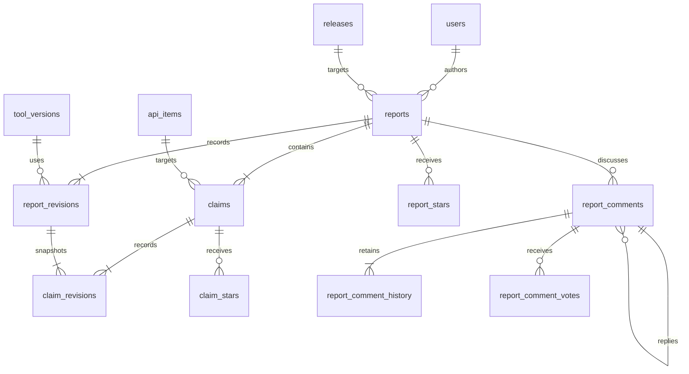

# proofs.rs backend design

Current specification: report-centered model, 2026-09-21. Existing claim-centered
schemas and endpoints are replaced; no compatibility layer or data conversion.

## Product model

A report publishes verification of one crate/version using one tool/version. A
report contains 1–100 claims about public APIs. Readers browse claims by API and
property, inspect evidence and assumptions, and open the report for discussion.
Report titles are required. Claim titles may be omitted or empty; the server
produces e.g. `Panic contract for arrayvec::ArrayVec::push (with Kani 0.66)`.
There is no execution-status field and no execution of submitted verification.
Evidence is a URL; correctness is evaluated by readers.

Reports and claims have independent stars, not acceptance judgments. Stars attach
to permanent identities and survive revisions. Self-stars are allowed but excluded
from karma. The initial karma policy counts non-self stars on public, nonwithdrawn
reports. Claim stars and comment votes do not affect karma. The policy in
`src/core.ts` provides both profile computation and SQL projections, so list/detail
scores cannot silently use a different algorithm. Account-level consolidated starred lists are private. Counts and per-target stargazer
lists are public, with profile links and 30-item keyset pagination. Detail-page star
controls appear to the right of the title; the count opens the stargazer list.
Loading shells only show headings that remain after loading; data-dependent or
auth-dependent titles use an explicit loading message instead.

## Relationships

`reports.id` is an integer; `claims.id` is a permanent UUID. Report release and
author are immutable (author may become null on account erasure). A claim's
report, API and property never change. Changing API/property creates a new claim.
Report revisions use `(report_id, revision_no)`; claim snapshots reference the
same report/revision and store presentation order. The foreign key
`(claim_id, report_id)` prevents inserting another report's claim into a snapshot.

`report_stars` and `claim_stars` use composite target/user primary keys. There is
no revision column. Report comments have a permanent UUID, report-local sequence
number and the report revision discussed. Parent comments must belong to the
same report. Comment history is private; audit events log administrative access.
Users, sessions, OAuth/device flows, token hashes, email contacts/preferences,
crates/releases/doc snapshots/API catalogue, tools/versions, import jobs, outbox,
deliveries, suppressions, quotas, idempotency and erasure infrastructure remain
separate normalized tables. No token name or bio is stored.

## Publication and revision invariants

- One transaction writes the report revision and every claim snapshot. There is
  no partial publication and no server-side draft. Forms hold unsubmitted work
  only in memory in the current tab.
- `POST /reports/validate` returns normalized values, generated titles and added,
  retained and removed claim IDs without saving. With `report_id`, only its author
  can preview a revision. New claim IDs are null in previews; omit `id` on publish.
- Revision requests include the full desired claim list and `expected_revision`.
  Optimistic concurrency rejects stale edits. Existing IDs must belong to this
  report and retain their API/property. Omitted claims leave the current list but
  retain history, links and stars. Previously removed IDs may be reintroduced.
- Shared explanation, trusted assumptions, evidence and limitations apply to all
  claims; individual fields add to them. Empty explanation/assumptions are valid.
  Each claim needs a shared or individual HTTP(S) evidence URL. Preconditions are
  required for panic contracts and for No UB on unsafe APIs; safe No UB is optional.
- Generated titles are stored in the revision. Revising with an empty title
  regenerates it from the submitted report tool/version; a supplied title remains.
- Withdrawing a report prevents further revisions and removes its claims from
  ordinary discovery. Permanent report/claim links and discussion remain readable.
- Report hiding also hides its claims, revisions and discussion. Exceptional
  audited redaction can clear both shared and individual revision text.

## Public API

All application endpoints use `/api/v1`. The checked-in OpenAPI 3.1 contract is
served at `/openapi.json`; the two-column `/docs/api` reference renders it directly.
Tests compare routes and methods with the specification. Administrative APIs are
excluded from the public contract.

| Purpose | Endpoints |
| --- | --- |
| Publication | POST `/reports/validate`, POST `/reports` |
| Revision | POST `/reports/:id/revisions` (full replacement snapshot) |
| Reports | GET `/reports`, `/reports/:id`, `/reports/:id/revisions`, `/reports/:id/revisions/:n` |
| Withdrawal | PUT `/reports/:id/withdrawal` |
| Crate version reports | GET `/crates/:name/:version/reports` |
| Per-API discovery | GET `/apis/:id/claims` |
| Permanent claim | GET `/claims/:id`, optional `report_revision` |
| Independent stars | PUT/DELETE `/reports/:id/star`, `/claims/:id/star` |
| Stargazers | GET `/reports/:id/stars`, `/claims/:id/stars` |
| Starred lists | GET `/me/starred-reports`, `/me/starred-claims` |
| Report discussion | GET/POST `/reports/:id/comments` |
| Comment operations | GET/PATCH/DELETE `/comments/:id`, PUT/DELETE `/comments/:id/vote` |
| Activity | GET `/me/reports`, `/users/:id/reports`, corresponding `/comments` |
| Tool usage | GET `/tools/:slug/reports` |

Old claim creation/validation/revision/withdrawal/comment/accept endpoints,
`/me/claims`, `/users/:id/claims`, `/me/accepts` and `/tools/:slug/claims` are absent
and return 404. Authentication, token management, catalogue preparation, tools,
user profiles and preferences keep their endpoint structure. Notification
preferences now use `report_comments`. Claim projections include report title,
revision, current-membership flag, report stars/comments and author karma.
A removed claim defaults to its last included revision and links to the latest
report. History references are explicit, never silently rewritten.

## UI

Home shows recent reports on the left and recent discussion on the right below
the search field. `/home` has no crate-activity field or query. The crate directory
shows total/matching counts and compact one-line rows: crate name, API count,
report count, claim count and most recent report publication/revision date.
API counts deduplicate public API paths across versions with visible, nonwithdrawn
reports; report/claim counts use those same versions and current revisions.
Crate descriptions are saved from crates.io version metadata during import, with
whitespace normalized, and displayed only on the individual crate page.
GitHub sign-in links go directly to OAuth; only new users then see the Sign up
confirmation page. The signed-out Publish page only asks the visitor to sign in.
All displayed reaction counts are labeled stars. The individual crate page lists
reports for the selected version below the API table, with 30-item cursor paging.
Report breadcrumbs link through crates, crate name and version. Claim star buttons
appear on claim detail pages, not inside a report’s claim list. Reports have shared details, claim
links, independent stars, revision navigation and discussion. Claim pages show
shared and individual evidence/assumptions and a prominent originating-report
panel with author karma, report stars and comment count; they have no comment
form. Publish/revise edits shared details and repeated claim sections, selects
APIs from the imported catalogue and previews the whole report before publishing.
My activity includes authored reports and visible comments. Deleted or hidden
comments are excluded from activity, including the current user's own activity.
Replies to replies indent again, with no depth cap. Token settings remain a simple
ID/date/revoke list. Device authorization displays the signed-in account, switch
account link, code and Authorize button.

Public page rendering does not wait for `/config` or `/me`: these bootstrap
requests run in parallel with public data loading. Home/search and Tools headings
and fixed links render before list responses; legal pages render without an API
request. Account-dependent pages display an explicit loading message while waiting
for authentication. A route generation guard discards stale responses, while
global account/config requests survive navigation. Errors preserve static page
content and search controls rather than replacing them with a blank page.

## Stack, authentication and security

Cloudflare Workers with Hono/TypeScript, D1 SQLite, private R2, Queues, Cron and
Workers Assets. Frontend uses TypeScript and native HTML controls. GitHub OAuth
creates an HttpOnly secure session with SameSite protection; mutations require
same-origin CSRF. GitHub credentials are never exposed to the frontend. Numeric
GitHub identity is stable; username and verified primary email refresh on login.
OAuth access tokens are discarded. Latest Terms version/time live on the account,
not on each contribution. Updated terms gate publishing, stars and votes until
agreement; sign-up uses the notice above the final Sign up button.

CLI device authorization is a one-time browser-approved exchange for a hashed,
90-day publishing token with UUID identity and no name. Bearer scope permits
catalogue reads/import preparation and report creation/revision/validation, not
star/comment mutations, moderation or token listings. Suspension revokes
sessions/tokens. Production and staging have separate databases and credentials.

JSON bodies are limited to 128 KiB; reports to 100 claims. Publication/revision
quota: 20/day per user; comments: 100/day. Text fields have explicit lengths.
Atomic D1 batches enforce active user, terms, report visibility and optimistic
concurrency. Idempotency keys protect creates and revisions from network retries.
Lists use opaque keyset cursors with 30 entries/page. User text is rendered escaped;
evidence URLs accept only HTTP(S). R2 archives and private history are not public.

## docs.rs import

On explicit preparation of the first crate/version, fetch crates.io metadata and
that release's docs.rs rustdoc JSON. Cache the parsed catalogue in D1 and source
in R2. Reuse it for later reports. No registry crawl or scraping fallback. Initial
rustdoc format allowlist: 60, 61. Public free functions and inherent methods are
supported; trait methods/implementations, Deref methods, unsupported syntax and
unresolved external reexports are not silently fabricated. The docs.rs build's
target/features define the API surface. Queue work and outbox events support
bounded retry and deduplication. Live import tests were explicitly waived.

## Comments, mail, moderation and recovery

Only new report comments generate notification events. Notify the report author
and reply author according to preferences, exclude the commenter and deduplicate
recipients. Edits and mentions do not notify. No mention linkification. Mail has a
report/comment permalink, not the body. Unknown send outcomes require operator
review rather than automatic resend. Email is currently disabled in both configs;
no backlog is accumulated. No live sending test is included.

Deleted comments show a tombstone with replies intact; previous text remains in
private history. Moderation can hide a whole report/comment, suspend accounts,
redact text or erase an account with audit records and R2 erasure markers. Account
erasure leaves ghost-attributed posts and removes private data and reactions.
Daily D1 export backups retain 30 generations in private R2. Restore into a private
DB, apply the latest erasure ledger, invalidate sessions/tokens and pause imports/
mail before serving it. See operations.md for exact procedures.

## Deployment and operating cost

Push main deploys and tests staging, then adds synthetic examples. New report-schema
resources use `*-reports-v1` database/bucket names and separate queues. No old data
is copied. Existing databases/buckets are left unbound pending separate cleanup.
Production is manual: only nyuichi may Run workflow after the exact commit passed
Staging; pushes never deploy production. The new production database starts empty,
including accounts and tools. Users re-login and CLIs reauthorize.

The previously approved planning baseline is Workers Paid USD 5/month before tax,
plus usage above included quotas and the domain renewal. This is a planning value,
not a billing guarantee or spending cap. Account billing previously included 10%
VAT. Email enabling, DNS/contact forwarding and billing alerts remain separate
operator configuration; this redesign does not activate them. Keep the USD 10/month
usage-review threshold and inspect D1 reads, R2, queues and import CPU as usage grows.

## Initial registration confirmation

GitHub OAuth for a new user creates only a ten-minute pending signup (minimal
GitHub identity, verified primary email, CSRF and same-site return route). It does
not create a user, preferences or session. The Sign up page identifies the GitHub
account, offers Use another account, and displays “By signing up, you agree to the
Terms and acknowledge the Privacy Policy.” above the Sign up button, with links.
The confirmation POST checks Origin, pending-cookie CSRF, expiry and current terms;
it atomically consumes the pending request and creates the user/session. Switching
accounts invalidates the pending signup. Expired pending records are cleaned up
by the existing scheduled job. Existing users continue directly through login.
The header no longer displays a signup notice.

### Tool-version known limitations

Each `tool_versions` row has `limitations` (plain text, maximum 10,000 characters,
empty by default) and `limitations_updated_at` (nullable UTC timestamp). There is
no reference URL. These describe the tool version itself, separately from report
shared limitations and claim-specific limitations. Empty text hides the section;
it does not assert that the tool has no limitations.

The public tool page links each version to `#/tool-version/{id}`. The version
page shows Known limitations, its update date, and a keyset-paginated list of
public, non-withdrawn reports whose latest revision uses that exact version.
Report and claim details link the tool/version and show a collapsed Tool
limitations section. All text is HTML-escaped and preserves line breaks.

`GET /api/v1/tool-versions/{id}` exposes the version metadata and tool name;
`GET /api/v1/tool-versions/{id}/reports` lists its reports. Report and claim
responses include `tool_limitations` and `tool_limitations_updated_at`. These
always reflect the current registry, including when viewing old revisions;
editing them does not create report revisions or change stars. Retired versions
remain readable. Publishing requires no additional fields.

Only operators can edit via the existing authenticated, CSRF-protected
`POST /api/v1/admin/action`, with action `tool_version_limitations`, target set
to the version ID, `limitations` containing the text (empty clears it), and the
required `reason`. Each successful edit records an audit event and update time.
Tool registration/retirement does not overwrite limitations. Correction requests
use the repository's existing GitHub Issues channel. Administrative operations
remain excluded from the public OpenAPI contract.
